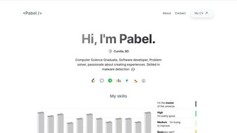

# My Portfolio Website

Welcome to my portfolio website built using Next.js and TypeScript. This website showcases my projects and provides information about me.

### Live url: https://mdpabel.com

<div style="display: flex; justify-content: center; align-items: center;">
  
</div>

## Features

- Responsive design for various screen sizes.
- Projects section to highlight my work.
- About Me section to introduce myself.
- Contact information for potential collaboration or inquiries.

## Getting Started

To run this project on your local machine, follow these steps:

1. Clone this repository:

   ```bash
   git clone https://github.com/yourusername/your-portfolio.git
   cd your-portfolio
   ```

2. Install the dependencies:

```bash
npm install
# or
yarn install
```

3. Start the development server:

```bash
npm run dev
# or
yarn dev
```

Contact
Email: mdpabel385@gmail.com
<br />
Website: https://mdpabel.com
